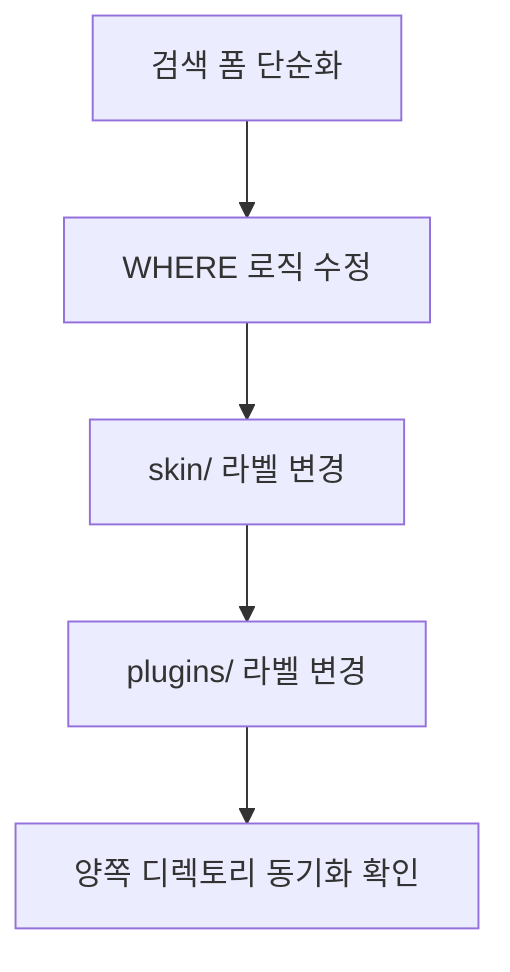

# Duo 부고알림 스킨 수정 계획

## 이슈 요약

1. **검색 기능 미작동**: 검색 시 모든 목록이 그대로 표시됨 (필터링 안 됨)
2. **라벨 변경**: '장소' → '장례식장' 전면 교체

---

## 1. 검색 기능 수정

### 현황 분석

- [`list.php`](skin/duo-obituary-kboard/list.php:16)에 3개 라디오 버튼 (고인명/상주명/고인명+상주명) 존재
- 커스텀 파라미터 `duo_obituary_target`, `duo_obituary_keyword` 사용
- [`functions.php`](skin/duo-obituary-kboard/functions.php:268) `duo_obituary_query_where()`에서 `kboard_list_where` 필터로 WHERE 조건 추가
- 검색 시 모든 결과가 표시됨 → WHERE 조건이 적용되지 않는 문제

### 수정 방향

```text
기존: [고인명] [상주명] [고인명+상주명]  [검색어입력] [검색]
변경: [검색어입력] [검색]  (통합검색 1개로 단순화)
```

### 수정 파일 및 내용

#### A. `skin/duo-obituary-kboard/list.php`

- **라인 6-7**: `duo_obituary_target` 변수 제거, `duo_obituary_keyword`만 유지
- **라인 18-20**: 3개 라디오 버튼 제거
- 검색 폼을 단순 통합검색으로 변경

```php
// 변경 전
$search_target = isset($_GET['duo_obituary_target']) ? ... : 'deceased_mourner';
<label><input type="radio" name="duo_obituary_target" ...> 고인명</label>
<label><input type="radio" name="duo_obituary_target" ...> 상주명</label>
<label><input type="radio" name="duo_obituary_target" ...> 고인명 + 상주명</label>

// 변경 후
// 라디오 버튼 전체 제거, 검색어 입력만 유지
```

#### B. `skin/duo-obituary-kboard/functions.php`

- **`duo_obituary_query_where()`** (라인 268-305): `duo_obituary_target` 분기 로직 제거
- 키워드가 있으면 항상 `deceased_name` + `chief_mourner` 통합 검색
- `duo_obituary_add_query_joins()`에서 `place` 필드도 검색 대상에 포함 고려

```php
// 변경 전: target에 따라 분기
if($target === 'deceased_name'){ ... }
else if($target === 'chief_mourner'){ ... }
else { ... }

// 변경 후: 항상 통합 검색
if($keyword !== ''){
    $like = '%' . $wpdb->esc_like($keyword) . '%';
    $conditions[] = $wpdb->prepare(
        '(duo_deceased_name.`option_value` LIKE %s OR duo_chief_mourner.`option_value` LIKE %s)',
        $like, $like
    );
}
```

---

## 2. 라벨 변경: '장소' → '장례식장'

### 변경 위치 (총 16곳 - skin/ + plugins/ 각 8곳)

#### skin/duo-obituary-kboard/ (8곳)

| 파일                                                          | 라인 | 현재                  | 변경                      |
| ------------------------------------------------------------- | ---- | --------------------- | ------------------------- |
| [`list.php`](skin/duo-obituary-kboard/list.php:46)            | 46   | `<th>장소</th>`       | `<th>장례식장</th>`       |
| [`list.php`](skin/duo-obituary-kboard/list.php:95)            | 95   | `장소` (모바일)       | `장례식장`                |
| [`document.php`](skin/duo-obituary-kboard/document.php:26)    | 26   | `<th>장소</th>`       | `<th>장례식장</th>`       |
| [`editor.php`](skin/duo-obituary-kboard/editor.php:59)        | 59   | `<label>장소</label>` | `<label>장례식장</label>` |
| [`latest.php`](skin/duo-obituary-kboard/latest.php:58)        | 58   | `<th>장소</th>`       | `<th>장례식장</th>`       |
| [`functions.php`](skin/duo-obituary-kboard/functions.php:31)  | 31   | `'place' => '장소'`   | `'place' => '장례식장'`   |
| [`functions.php`](skin/duo-obituary-kboard/functions.php:624) | 624  | `'place' => '장소'`   | `'place' => '장례식장'`   |
| [`functions.php`](skin/duo-obituary-kboard/functions.php:852) | 852  | `<th>장소</th>`       | `<th>장례식장</th>`       |

#### plugins/duo-obituary-kboard/skins/duo-obituary-kboard/ (8곳)

- 위와 동일한 파일/라인 위치에 동일 변경 적용

---

## 3. 작업 순서



1. `skin/duo-obituary-kboard/list.php` - 라디오 버튼 제거, 통합검색 폼으로 변경
2. `skin/duo-obituary-kboard/functions.php` - `duo_obituary_query_where()` 통합검색 로직으로 수정
3. `skin/duo-obituary-kboard/` 모든 파일 - '장소' → '장례식장' 변경
4. `plugins/duo-obituary-kboard/skins/duo-obituary-kboard/` 모든 파일 - 동일 변경 적용
5. 양쪽 디렉토리 파일 내용 일치 확인
